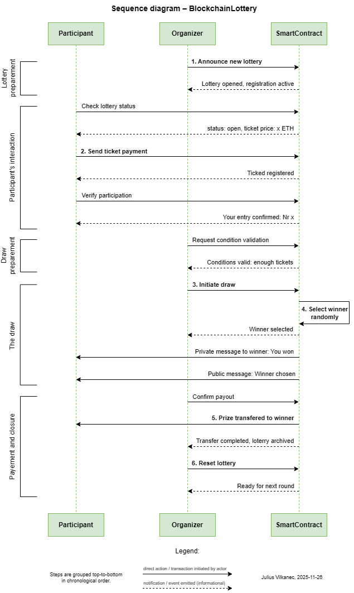

# Decentralizuota loterija „BlockchainLottery“

Šiame projekte kuriama išmanioji sutartis ir decentralizuota aplikacija, skirta paprastai decentralizuotai loterijos sistemai Ethereum tinkle.
Modelio tikslas – užtikrinti skaidrų, patikimą ir automatinį laimėtojo parinkimą, naudojant viešąją blokų grandinę.

## Dalyviai

### 1. Organizatorius

- Inicializuoja naują loterijos raundą
- Nustato bileto kainą
- Paleidžia laimėtojo išrinkimo funkciją
- Gali atsiimti nepanaudotas lėšas

### 2. Dalyvis

- Prisijungia prie DApp naudojant MetaMask
- Įsigyja bilietą, sumokėdamas nustatytą bilieto kainą
- Dalyvauja loterijoje ir laukia rezultato

## Verslo logika

1. Organizatorius sukuria naują loteriją ir nustato fiksuotą bilieto kainą.
2. Dalyviai įsigyja bilietus, siųsdami tiksliai bilieto kainos dydžio ETH kiekį į išmaniąją sutartį.
3. Visi dalyviai automatiškai įtraukiami į žaidėjų sąrašą.
4. Kai pasiekiamas nustatytas minimalus dalyvių skaičius, organizatorius aktyvuoja „Draw Winner“ funkciją.
5. Išmanioji sutartis atsitiktinai parenka vieną adresą iš dalyvių sąrašo.
6. Visa surinkta suma pervedama laimėtojui.
7. Loterija nustatoma į pradinę būseną ir gali būti pradedama iš naujo.

## Sekos diagrama

Ši seka pavaizduoja decentralizuotos loterijos BlockchainLottery procesą tarp trijų pagrindinių dalyvių: Dalyvis (Participant), Organizatorius (Organizer), Išmanioji sutartis (SmartContract). Diagrama apima visą loterijos ciklą — nuo paskelbimo iki užbaigimo.

**Diagramoje pavaizduoti tokie etapai:**

1. **Loterijos paruošimas.**
Organizatorius paskelbia naują loteriją, sutartis aktyvuojama, dalyviai gali tikrinti jos būseną.

2. **Dalyvių sąveika.** Dalyviai siunčia bilieto mokėjimą, sutartis registruoja bilietus ir patvirtina dalyvavimą.

3. **Pasiruošimas traukimui.** Organizatorius tikrina, ar surinkta pakankamai bilietų, ir inicijuoja loterijos pradžią.

4. **Laimėtojo išrinkimas.** Išmanioji sutartis atsitiktinai parenka laimėtoją ir perduoda apie tai informaciją tiek privačiai pačiam laimėtojui, tiek viešai.

5. **Išmokėjimas ir užbaigimas.** Laimėtojui pervedamas prizas, loterija archyvuojama ir sistema paruošiama kitam raundui.

---



---

Ši diagrama padeda aiškiai suprasti verslo logiką ir tarpusavio sąveikas, kurios bus perkeltos į „Solidity“ išmaniąją sutartį ir decentralizuotą aplikaciją.

## Naudojimosi instrukcija

### Lokalūs testai su Truffle

- Kompilioti išmaniąją sutartį

``` bash
truffle compile
```

- Paleisti Truffle blockchain (atskirame terminale) su 10 testinių adresų ir 100 ETH kiekviename iš jų

``` bash
truffle develop
```

- Deploy'inti sutartį

``` bash
truffle migrate --reset
```

- Paleisti test.js

``` bash
truffle test
```

### Testavimas Sepolia tinkle

- Deploy'inti sutartį

``` bash
truffle migrate --network sepolia
```

- Paleisti sepolia-test.js Sepolia tinkle

``` bash
truffle exec ./test/sepolia-test.js --network sepolia
```

## Naudojami Metamask adresai

Owner:  
`0x74c3443553d2f59d667c08d2f6d56085b4b6b119`

Player1:  
`0xabeaa558f21c5dac4be0e5ff188ec2b1d8b6ee68`

Player2:  
`0x249018879ce51fd18ae27ef3d8ee4ee2d25d7bf7`

Player3:  
`0x5afc5eeb99284e771e666d66d4f7c1955a820688`

## Projekto struktūra

``` bash
BlockchainLottery/
│
├── contracts/
│   └── BlockchainLottery.sol      # Išmanioji sutartis (sukurta Remix platformoje)
│
├── diagrams/
│   └── SequenceDiagram.png        # Sekos diagrama (3 užduotis)
│
├── migrations/
│   └── 1_deploy_contracts.js      # Deploy skriptas (testavimo tinklo paleidimas)
│
├── screenshots/                   # Darbo eigos ekrano nuotraukos
│
├── test/
│   ├── test.js                    # Lokalūs Truffle testai
│   └── sepolia-test.js            # Sepolia tinklo testai
│
├── truffle-config.js              # Tinklų (local, sepolia) konfiguracija
└── README.md                      # Dokumentacija
```

## Naudingi linkai

Etherscan (Sepolia):
<https://sepolia.etherscan.io/>

MetaMask:
<https://metamask.io/>

Sepolia PoW Faucet:
<https://sepolia-faucet.pk910.de/#/>

Remix IDE:
<https://remix.ethereum.org/>

## Papildomi duomenys

**Užduoties atlikimas:**

Darbo pradžioje susipažinau su pateiktu pavyzdiniu verslo modeliu ir pagal jį suformavau savo idėją — decentralizuotą loterijos sistemą Ethereum tinkle. Aprašiau verslo logiką, sudariau loterijos proceso sekos diagramą ir tik tada perėjau prie programavimo.

Išmaniąją sutartį kūriau ir testavau Remix IDE aplinkoje, palaipsniui tikrinant pagrindines funkcijas: bilietų pirkimą, laimėtojo parinkimą ir prizų išmokėjimą. Vėliau projektą perkėliau į Truffle, kuriame sukūriau lokalius automatizuotus testus ir juos išplėčiau, pridėdamas klaidų scenarijus ir balansų tikrinimą.

Perėjęs į Sepolia testnet, atlikau papildomus testus su MetaMask paskyromis ir Etherscan logais, kad įsitikinčiau teisingu sutarties veikimu realiame tinkle. Baigiamajame etape pradėjau kurti front-end aplikaciją, skirtą patogiam loterijos valdymui per naršyklę.

**Autorius:** Julius Vilkanec  
**Studijų programa:** Informacinių sistemų inžinerija, Vilniaus Universitetas  
**Kursas:** 2 kursas  
**Versija:** v0.1  
**Data:** 2025-12-08
